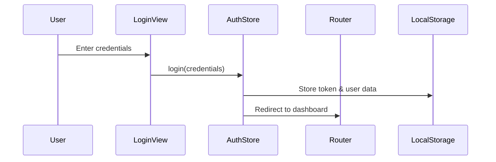

# Technical Software Design: Authentication and Login System

## 1. Overview
This document outlines the technical design for the authentication and login system in our Vue.js application. The system provides user authentication functionality with a focus on security, usability, and maintainability.

## 2. Architecture

### 2.1 Components
- **Login View** (`/src/views/LoginView.vue`)
  - Handles user login form and interactions
  - Validates user input
  - Communicates with auth store

- **Auth Store** (`/src/stores/auth.js`)
  - Manages authentication state
  - Handles login/logout operations
  - Stores user data and tokens
  - Provides authentication status

### 2.2 Data Flow


## 3. Implementation Details

### 3.1 Auth Store Implementation
```javascript
// stores/auth.js
export const useAuthStore = defineStore('auth', {
  state: () => ({
    user: null,
    token: null
  }),
  
  actions: {
    login(credentials) {
      // Store user data and token
      this.user = { /* user data */ }
      this.token = 'mock-token'
      localStorage.setItem('token', this.token)
    },
    
    logout() {
      this.user = null
      this.token = null
      localStorage.removeItem('token')
    },
    
    isAuthenticated() {
      return !!this.token
    }
  }
})
```

### 3.2 Login View Implementation
```vue
// views/LoginView.vue
<template>
  <form @submit.prevent="handleLogin">
    <input v-model="email" type="email" required>
    <input v-model="password" type="password" required>
    <button type="submit">Login</button>
  </form>
</template>

<script setup>
const handleLogin = async () => {
  await auth.login({ email, password })
  router.push('/dashboard')
}
</script>
```

### 3.3 Router Guard Implementation
```javascript
// router/index.js
router.beforeEach((to, from, next) => {
  const auth = useAuthStore()
  
  if (to.meta.requiresAuth && !auth.isAuthenticated()) {
    next('/login')
  } else {
    next()
  }
})
```

## 4. Security Considerations

### 4.1 Token Storage
- Tokens are stored in localStorage for persistence
- Token is removed on logout
- Session expires on browser close

### 4.2 Route Protection
- Protected routes require authentication
- Unauthorized access redirects to login
- Authentication state checked on route changes

## 5. Future Enhancements

### 5.1 Planned Features
1. Implement JWT token authentication
2. Add password reset functionality
3. Add remember me option
4. Implement refresh token mechanism
5. Add OAuth integration

### 5.2 Security Improvements
1. Implement CSRF protection
2. Add rate limiting for login attempts
3. Implement 2FA
4. Add secure password policies
5. Implement session timeout

## 6. Dependencies
- Vue Router for navigation
- Pinia for state management
- Vue 3 Composition API

## 7. Testing Strategy

### 7.1 Unit Tests
- Test auth store actions and mutations
- Test login form validation
- Test router guards

### 7.2 Integration Tests
- Test login flow
- Test token persistence
- Test protected route access

## 8. Error Handling
- Form validation errors
- Network request errors
- Authentication failures
- Session expiration

## 9. API Endpoints
When implementing backend integration:

```
POST /api/auth/login
  Request:
    - email: string
    - password: string
  Response:
    - token: string
    - user: object

POST /api/auth/logout
  Request:
    - token: string
  Response:
    - success: boolean

GET /api/auth/user
  Request:
    - token: string (header)
  Response:
    - user: object
```
